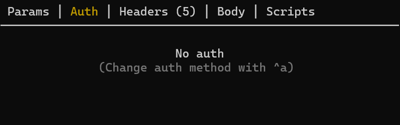
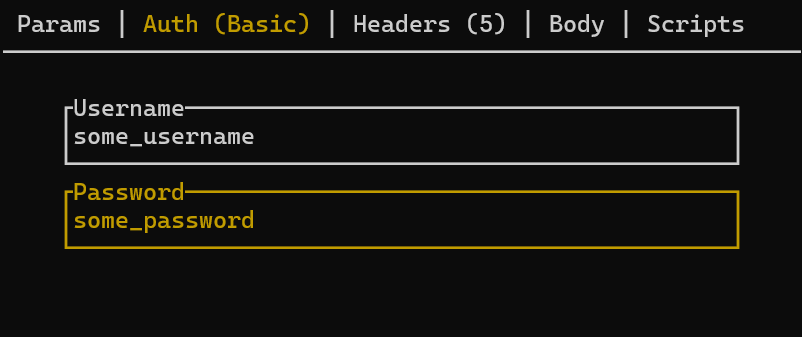
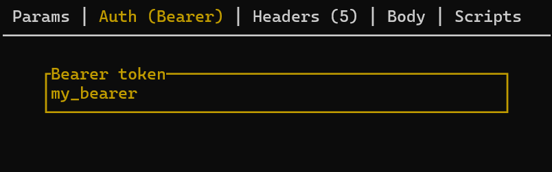

# Authentication

## Introduction

ATAC supports three types of authentication to help you manage your HTTP requests securely and efficiently.

With the default key bindings, you can change the current request's authentication method by pressing `ctrl-a`.
This action will cycle through the available authentication methods (No Auth, Basic Auth, Bearer Auth).
Each press of `ctrl-a` will switch to the next method in the sequence, allowing you to quickly and easily select the desired authentication type for your request.

## Authentication Methods

### No Authentication

This is the default method where no authentication is applied to the request. It is suitable for public endpoints that do not require any credentials.

### Basic Authentication

Basic Authentication involves sending a username and password encoded in Base64 with each request. This method is straightforward but should be used over HTTPS to ensure credentials are not exposed in transit.

When using Basic Authentication, you will need to provide a username and password. These credentials will be included in the `Authorization` header of your request, encoded in Base64.

### Bearer Authentication

Bearer Authentication involves sending a token with each request. This method is commonly used with OAuth 2.0 and other token-based authentication systems. It provides a more secure way of sending credentials as it does not expose user credentials directly.

For Bearer Authentication, you will need to provide a token. This token will be included in the `Authorization` header of your request in the format `Bearer <token>`.
