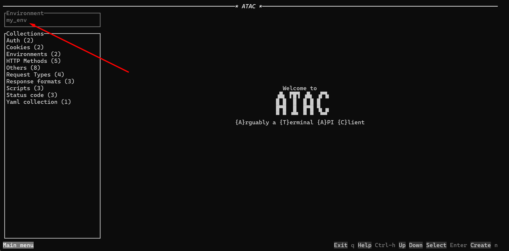
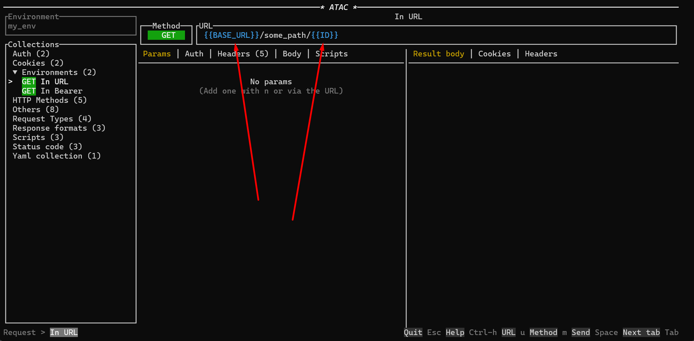

# Environment Variables

## Overview

ATAC allows you to manage and use environment variables through `.env` files. These environment variables enable you to configure various settings and parameters dynamically, enhancing flexibility and ease of use.

## Setting Up Environment Variables

### Creating an Environment File

To define environment variables, create a `.env.my_env_name` file inside the app directory. Here’s an example of what an environment file might look like:

```text title=".env.my_env_name"
BASE_URL=https://httpbin.org
ID=15
FILE_NAME=Cargo.toml
```

### Using Environment Variables

To use these environment variables within your requests, reference them by writing `{{my_variable_name}}`. For example:

- `{{BASE_URL}}` will be replaced by `https://httpbin.org`
- `{{ID}}` will be replaced by `15`
- `{{FILE_NAME}}` will be replaced by `Cargo.toml`

Environment variables are available everywhere except collection name, request name and textual bodies (JSON, HTML, XML, ...).

## Using Environment Variables in TUI

In the TUI, the name of the selected environment will appear in the top left gray box as follows:



When an environment variable from your selected environment is used in the request, it will be highlighted in blue, making it easy to identify and confirm.




### Selecting an Environment

To select an environment in the TUI, ensure that your `.env.my_env_name` file is placed correctly in the app directory. The default key to change the selected environment is `e`, it will loop through the parsed .env files.

## Using Environment Variables in CLI

In the CLI, you can specify which environment to use with the `--env my_env_name` parameter. This tells ATAC to use the environment variables defined in the `.env.my_env_name` file for the current session.

### Example Usage

```bash
atac request my_collection/my_request send --env my_env_name
```

This command will load the environment variables from `.env.my_env_name` and make them available for use in your requests.